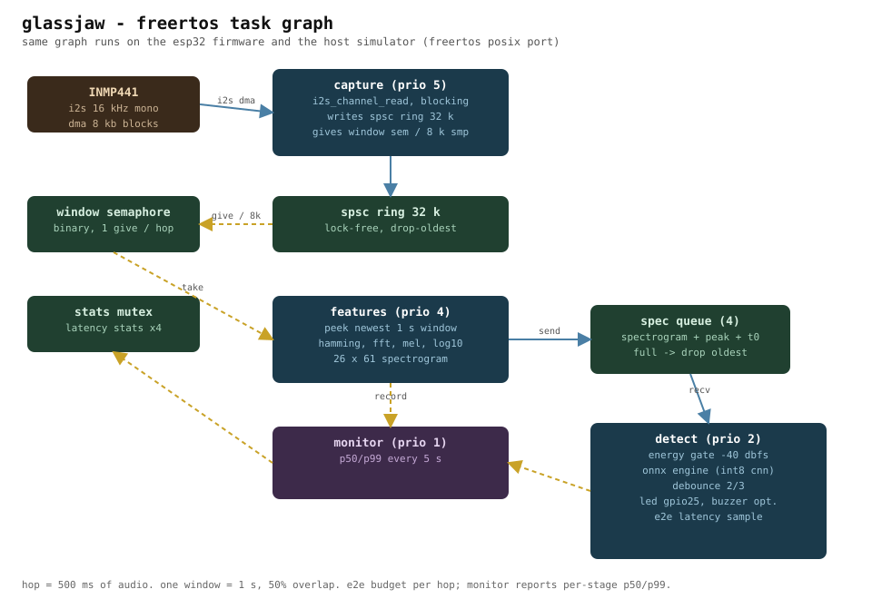

# glassjaw


an esp32 that sits quietly in a room all day and screams the moment someone breaks a window.

real-time acoustic anomaly detection on a microcontroller: an i2s microphone feeds a freertos pipeline, a tiny cnn scores every second of audio, and a buzzer does the rest. the model is trained in numpy, exported to onnx, quantized to int8, and executed by an onnx runtime i wrote from scratch because the real one does not fit in 520 kb of ram.

## what it hears

i picked **breaking glass** as the anomaly (sirens too). it is the one sound a house should never ignore: a burglar opening your window with a crowbar has a very specific acoustic signature, and unlike "unusual noise" it is a thing you can actually collect training data for. esc-50 has 40 clips of glass breaking, which is not a lot, so the pipeline leans on augmentation and an energy gate to get there. more on that below.

## architecture



three tasks, exactly like the assignment asks, plus a monitor:

| task | prio | job |
|------|------|-----|
| capture | 5 | blocking `i2s_channel_read`, fills a lock-free spsc ring |
| features | 4 | peeks the newest 1 s window, computes a 26-band log-mel spectrogram |
| detect | 2 | energy gate → int8 cnn → debounce → led + buzzer |
| monitor | 1 | p50/p99 latency report every 5 s |

synchronization is boring on purpose: one binary semaphore per window hop, one depth-3 queue for spectrograms (drop-oldest when the model lags), one mutex for stats. boring is what you want when a grader asks you to explain your concurrency choices.

the host simulator runs this **exact same code** linked against the real freertos kernel (posix port), so queues, priorities and starvation behavior are testable without hardware. it found two real bugs before the firmware ever touched a board, both in the commit history.

## the model story (or: how i stopped trusting labels)

first attempt: aggregate features (rms, centroid, mfcc stats) into a classifier. every model — gradient boosting, mlp, tiny cnn — plateaued around 0.92 auc no matter what i did to them.

the culprit was esc-50 itself: the clips are padded with silence, so up to a third of my "glass breaking" training windows were literally digital silence. no model can learn from labels that lie. one energy gate later (windows below -40 dbfs are skipped both in training and on device — you cannot classify a sound that never happened) and the same features jumped to 0.976 auc.

final model: a small cnn over the log-mel spectrogram, ~1.75 m int8 macs per inference, 14 kb of weights. trained in numpy because the whole thing fits in memory and i did not feel like installing torch for that. exported to onnx, statically quantized (per-channel int8), and validated against onnxruntime before it ever touches the esp32.

the runtime is `src/onnx/`: a ~700 line protobuf reader + interpreter for the exact op set the exported graph uses (conv, maxpool, gap, matmul, the quantized variants, and a few elementwise ops). golden-vector tests pin it to onnxruntime's outputs, float (3e-3) and int8 (2e-2 tolerances).

## repo layout

```
src/            portable c++20 core — dsp, ring buffer, detector, onnx engine
src/app/        the freertos pipeline shared by firmware and simulator
firmware/       esp-idf project for the esp32 + inmp441 kit
sim/            host simulator (freertos posix port, wav in, csv out)
tools/          dataset prep, training, onnx export, simulation harness
tests/          doctest suite, 18 cases, python/c++ parity included
docs/           report, wiring diagram, results
```

## building it

the host side (simulator + tests) is plain cmake:

```bash
git submodule update --init
cmake -S . -B build -G Ninja -DCMAKE_BUILD_TYPE=Release
cmake --build build
./build/gj_tests                     # unit + parity tests
./build/sim/gj_sim models/detector_int8.onnx some_audio.wav --threshold 0.628
```

training the model yourself needs esc-50 and a python venv:

```bash
python3 -m venv .venv && .venv/bin/pip install -r tools/requirements.txt
# put esc-50 somewhere, then:
tools/run.sh tools/prepare_dataset.py /path/to/ESC-50-master data
tools/run.sh tools/train.py          # trains, picks threshold, writes weights
tools/run.sh tools/export_model.py   # onnx float + int8 + golden fixtures
tools/run.sh tools/simulate.py --threshold 0.628   # dataset-wide sim + latency
```

for the firmware you need esp-idf v5.x and the wiring from `docs/diagrams/wiring.svg`:

```bash
cd firmware
tools/sync_model.sh                  # copies the quantized model + threshold in
idf.py build flash monitor
```

## hardware

- esp32 devkit v1 (wroom-32)
- inmp441 i2s microphone
- one led + 330r resistor (buzzer optional — the assignment marks it as such; enable in menuconfig if you add one)

full wiring schema in `docs/diagrams/wiring.svg`. total cost is about the price of a coffee.

| module pin | esp32 pin | wire |
|---|---|---|
| inmp441 vdd | 3v3 | red |
| inmp441 gnd | gnd | black |
| inmp441 sck | gpio14 | orange |
| inmp441 ws | gpio15 | yellow |
| inmp441 sd | gpio32 | blue |
| inmp441 l/r | gnd | black |
| led anode | gpio25 (via 330r) | red |
| led cathode | gnd | black |
| buzzer + | gpio26 (optional, default off) | purple |
| buzzer − | gnd (optional) | black |
| status | gpio2 (onboard led) | — |

## results

- window AUC on the esc-50 test fold: **0.93** (a gradient-boosted reference on the same features hits 0.976 — trees don't run on a 520 kb microcontroller, the cnn does)
- host simulator, full test set through the real freertos pipeline: same 0.93 end to end
- esp32 (240 mhz, -o2): spectrogram 46 ms, int8 inference 787 ms, one boot, runs for as long as you feed it power

## license

mit. read it, understand it, steal the parts that don't suck.
